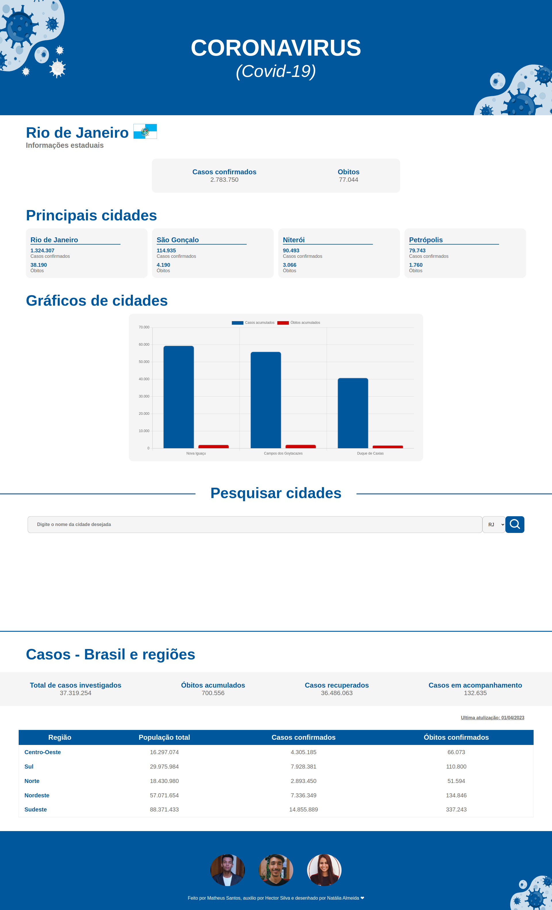

<h1 align="center">Coronavirus RJ 🦠</h1>

Projeto de site informativo com dados sobre a pandemia do Covid-19 no RJ e Brasil!
 

  <h2>🏠 Home </h2>
  

## 🚀 Tecnologias

Esse projeto foi desenvolvido com as seguintes tecnologias:

-  Figma
-  HTML
-  CSS
-  JavaScript
-  API
-  Vercel

## 🖱 Página publicada

-  https://matheussantos10.github.io/coronavirus-rj/
-  https://coronavirus-rj.vercel.app/
